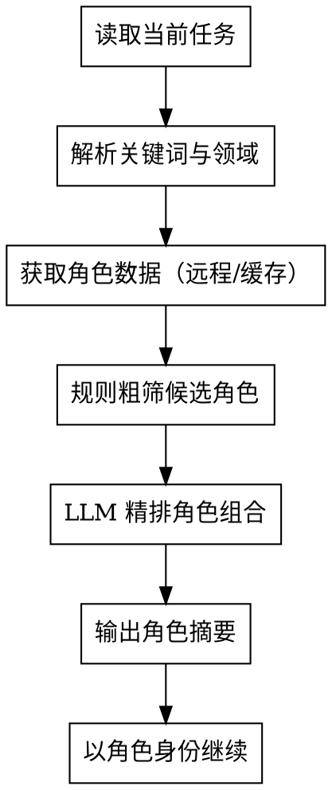

---
# 元数据说明：name 与 description 供 skill 选择器读取，description 描述触发条件
name: agency-agents
description: 当当前任务需要专业 AI 专家角色或角色组合，且你不确定哪个 agency-agents 角色最合适时使用。典型场景包括代码审查、UI/UX 设计、安全审计、增长策略、测试、架构设计、调试或跨学科协作。
---

# agency-agents 角色调度

## 概述

本 Skill 将 [msitarzewski/agency-agents](https://github.com/msitarzewski/agency-agents) 的 140+ 专家角色封装为可自动调度的角色推荐器。调用后，它会分析当前任务，自动选出最合适的 1~3 个角色，并输出摘要，让当前 agent 立即以这些专家身份继续工作。

## 何时使用

- 用户提出一个需要专业身份处理的任务，但没有指定具体角色。
- 你判断当前任务需要跨领域协作（例如 UI 设计 + 前端实现 + UX 研究）。
- 对话主题发生漂移，需要重新评估适合的角色组合。
- 你希望获得结构化的"谁来干、怎么协作"的指导。

## 何时不使用

- 用户已经明确指定了角色（直接按用户要求执行）。
- 任务过于简单通用，不需要专家身份（例如"你好""总结一下"）。
- 当前环境无法访问网络且本地缓存中无相关角色。

## 核心工作流



## 数据获取与缓存（同步机制）

角色数据按以下优先级获取：

1. **远程拉取**（带超时保护）：读取上游仓库 `msitarzewski/agency-agents` 的 `divisions.json` 与部门文件列表，本次使用最新数据。
2. **缓存写回**：拉取成功后，将结果写回本目录 `roles-index.json`（自动更新 `last_updated` 与 `upstream_sha`），使每次在线调用即完成一次自动同步。
3. **兜底**：拉取失败或超时 → 使用 `roles-index.json`（即最近一次同步的缓存）。

补充说明：

- `roles-index.json` 由 `sync.ps1` 或运行时缓存自动生成，无需手动维护；`zh-overrides.json` 提供 slug 的中文名/简介覆盖（手动维护）。
- 选定的角色需要完整 prompt 时，按需从远程拉取并缓存到本目录 `roles-cache/`，避免重复拉取。

## 分步说明

### 1. 读取当前任务

无需用户显式输入。自动读取当前会话中的：
- 用户最新请求文本。
- 当前项目上下文（文件路径、技术栈等，如果可用）。
- 历史对话中已确认的目标和约束。

### 2. 解析关键词与领域

从任务描述中提取：
- 核心动作（review、设计、调试、增长、测试等）。
- 技术领域（前端、后端、安全、AI、数据库等）。
- 输出目标（代码、文档、方案、报告等）。

### 3. 规则粗筛候选角色

先按"数据获取与缓存"小节获取角色数据，再读取本 Skill 目录下的 `tool-mappings.json`，根据关键词匹配候选部门和角色。

匹配算法（必须严格按此执行，禁止裸子串包含）：

```
对每条映射 entry：
  英文命中 = 任一 keywords_en 满足正则 \b{kw}s?\b（re.IGNORECASE，kw 先 re.escape）
  中文命中 = 任一 keywords_zh 是任务文本的子串（中文无空格分词，子串即合理）
  entry 命中 = 英文命中 或 中文命中
  若 entry 命中 → 合并 entry.roles 到候选集合（去重）
```

规则：
- 词边界保证 "fix" 不会误命中 "prefix/fixture"、"review" 不会误命中 "preview"、"test" 不会误命中 "latest"。
- 多个条目命中时，合并候选角色并去重。
- 每个候选角色保留 slug、名称、一句话职责。

### 4. LLM 精排角色组合

将以下信息提交给 LLM：
- 用户原始任务描述。
- 候选角色列表（来自粗筛）。
- 约束：最多 3 个角色，每个角色必须有明确职责边界。

LLM 返回 JSON 结构：

```json
{
  "selected_roles": [
    {
      "slug": "security-engineer",
      "name": "安全工程师",
      "responsibility": "威胁建模与漏洞审查",
      "boundary": "不直接写业务代码，只输出风险点和修复建议",
      "reason": "任务涉及用户输入处理，需先识别安全风险"
    }
  ],
  "collaboration": "安全工程师先识别风险，后端架构师再调整设计，代码审查员最后复核",
  "optional_roles": [],
  "confidence": "high"
}
```

**返回校验（必须执行）**：
1. 能否解析为合法 JSON，且包含 `selected_roles` 数组；
2. 每个角色的 slug 必须存在于候选角色集合中，且包含 name/responsibility/boundary/reason 字段；
3. 校验失败 → 让 LLM 重试一次 → 仍失败 → 使用粗筛候选的前 3 个作为兜底，并自动拼接协作方式。

### 5. 输出角色摘要

使用以下模板输出：

```markdown
## 推荐角色组合

1. **{角色名}**（{英文名}）
   - 职责：{一句话职责}
   - 边界：{不做什么}
   - 理由：{为什么选它}

## 协作方式

{步骤化描述}

## 下一步

当前 agent 将以上述角色组合身份继续处理你的请求。
```

### 6. 以角色身份继续

输出摘要后，不要询问用户是否确认。立即以选定角色身份继续执行原任务。需要完整角色 prompt 时按"数据获取与缓存"小节获取。

## 输入与输出

### 输入

无显式输入。Skill 自动读取当前会话上下文。

### 输出

结构化摘要，包含：
- 推荐角色组合（1~3 个）。
- 每个角色的职责、边界与选择理由。
- 角色之间的协作顺序。
- 下一步行动说明。

## 速查表

| 任务类型 | 推荐部门 | 典型角色组合 |
|---------|---------|-------------|
| 代码审查 | engineering + security + testing | 代码审查员、安全工程师、后端架构师 |
| UI/UX 设计 | design + engineering | UI 设计师、UX 研究员、前端开发 |
| 安全审计 | security + engineering | 安全工程师、后端架构师、代码审查员 |
| 增长方案 | marketing + product | 增长黑客、内容创作者、产品经理 |
| 性能优化 | engineering + testing | 性能测试员、后端架构师、DevOps 工程师 |
| Agent 编排 | specialized + engineering | Agent 编排者、MCP 构建者、后端架构师 |
| 重构迁移 | engineering + testing | 后端架构师、代码审查员、QA 专员 |
| 文档编写 | engineering | 技术文档工程师、前端开发、代码审查员 |

## 边界条件

| 场景 | 处理方式 |
|------|---------|
| 任务模糊（粗筛命中 0 条且无法解析领域关键词） | 先询问 1~2 个澄清问题，再选角色 |
| 粗筛命中 ≥1 条 | 直接进入精排，不询问 |
| 无合适角色 | 返回"未找到匹配角色"，建议用通用助手或手动指定 |
| 网络不可用 | 使用本目录 `roles-index.json` 缓存兜底 |
| 远程仓库结构变化 | 记录失败信息，fallback 到缓存 |
| LLM 返回非法 JSON | 重试一次 → 仍失败用粗筛前 3 个兜底 |
| 用户明确指定角色 | 尊重用户选择，跳过自动分析 |
| 角色组合冲突 | 输出冲突说明，并给出优先级建议 |
| 候选角色超过 3 个 | 保留最相关的 3 个，其余放入"可选参考" |

## 常见错误

- **要求用户手动指定角色**：本 Skill 的核心价值就是自动选择，调用后应直接输出推荐结果。
- **输出完整角色 Markdown**：只输出摘要，完整 prompt 留给当前 agent 按需获取。
- **选择过多角色**：超过 3 个角色会导致分工混乱，必须精简。
- **忽略角色边界**：每个角色必须明确"做什么"和"不做什么"，否则会产生职责重叠。
- **裸子串匹配关键词**：必须使用词边界正则，否则 "fix" 会命中 "prefix"、"test" 会命中 "latest"。
- **跳过 LLM 返回校验**：非法 JSON 必须走重试/兜底流程，不能直接使用。

## 示例

### 示例 1：代码审查

**用户请求**："帮我 review 这个新提交的登录模块代码。"

**Skill 输出**：

```markdown
## 推荐角色组合

1. **安全工程师**（Security Engineer）
   - 职责：审查认证流程、密码处理、会话管理风险
   - 边界：不直接修改业务代码，只输出风险点
   - 理由：登录模块涉及敏感凭证处理

2. **代码审查员**（Code Reviewer）
   - 职责：检查代码质量、可维护性、测试覆盖
   - 边界：关注实现层面，不重新设计架构
   - 理由：需要结构化审查报告

3. **后端架构师**（Backend Architect）
   - 职责：评估登录模块与整体服务边界的合理性
   - 边界：不逐行审代码，只评估架构影响
   - 理由：登录模块与权限服务边界需要评估

## 协作方式

1. 安全工程师先识别风险点；
2. 后端架构师评估架构影响；
3. 代码审查员最后输出结构化审查报告。

## 下一步

当前 agent 将以上述角色组合身份继续处理你的请求。
```

### 示例 2：UI 设计

**用户请求**："设计一个移动端注册页面。"

**Skill 输出**：

```markdown
## 推荐角色组合

1. **UX 研究员**（UX Researcher）
   - 职责：梳理用户流程、可用性、错误状态
   - 边界：不输出高保真视觉稿
   - 理由：注册流程需要清晰的可用性基础

2. **UI 设计师**（UI Designer）
   - 职责：负责页面布局、视觉层次、组件选择
   - 边界：不编写实现代码
   - 理由：需要高保真视觉方案

3. **前端开发**（Frontend Developer）
   - 职责：评估实现可行性与响应式约束
   - 边界：不替代 UI 设计决策
   - 理由：需要确保设计可在移动端实现

## 协作方式

1. UX 研究员先梳理用户流程；
2. UI 设计师基于此输出视觉方案；
3. 前端开发最后评估实现成本。

## 下一步

当前 agent 将以上述角色组合身份继续处理你的请求。
```
